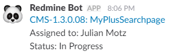

# Redmine Slack Bot

Slack bot that replies information about a Redmine issue when a message contains a hash with a Redmine id (e.g. #1234).

# Contributing

Please head over to [CONTRIBUTING.md](.github/CONTRIBUTING.md).